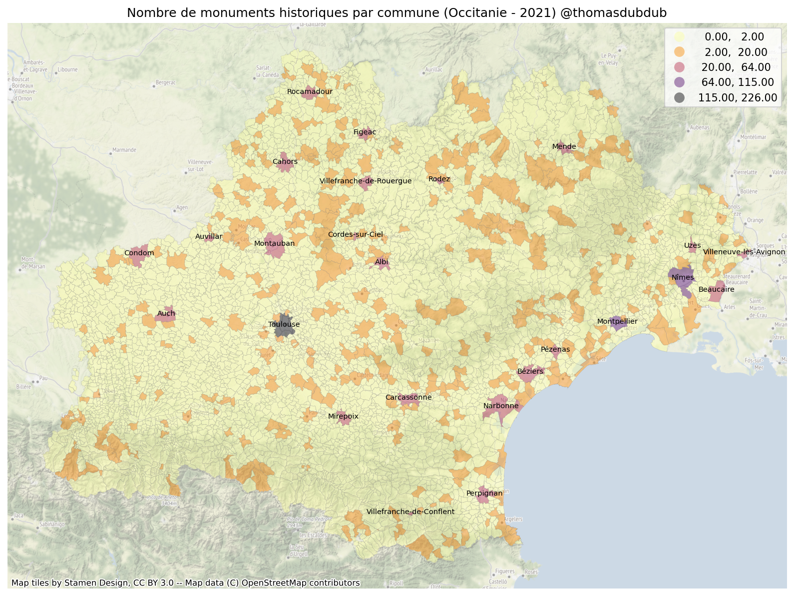
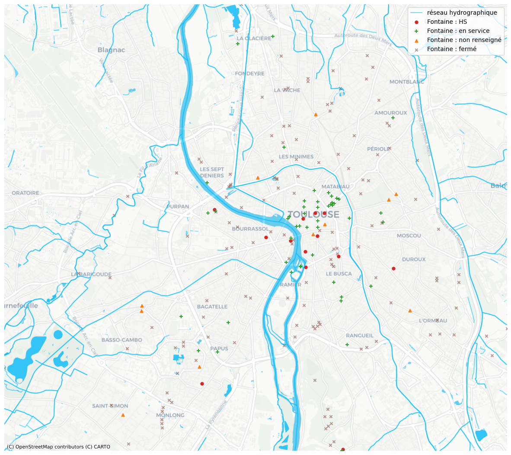

# Occitanie Potpourri

One of my guilty pleasures is to extract, analyze and visualize open data of my region.
I will therefore put in this repository all notebooks based on French open data with a focus on the French region Occitanie, the French department Haute-Garonne and the French city Toulouse.

 
Example 1: plot the number of historical monuments in each town (commune) of Occitanie (choropleth)
 

 

Example 2: plot Toulouse water system including water fountains

 

Example 3: plot districts of Toulouse based on the ratio of graduated residents (BAC+5+)

 

## Running the tests

Run the notebook occitanie_mh to visualize historical monuments in Occitanie
Run the notebook toulouse_water_system to visualize Toulouse water system
Run the notebook toulouse_bac5 to visualize districts of Toulouse based on the ratio of graduated residents (BAC+5+)

## Built With

The following Python libraries are used in these notebooks:
* [pandas](https://pandas.pydata.org/) - Python Data Analysis Library
* [GeoPandas](https://geopandas.org/en/stable/) - GeoPandas is an open source project which extends the datatypes used by pandas to allow spatial operations on geometric types.
* [contextily](https://github.com/darribas/contextily) - Context geo-tiles in Python

## Versions

This code was tested with following versions:
* occitanie_mh: Python 3.9.4, geopandas 0.10.2, contextily 1.1.0
* toulouse_water_system: Python 3.9.4, pandas 1.3.4, geopandas 0.10.2, contextily 1.1.0, shapely 1.7.1
* toulouse_bac5: Python 3.9.4, geopandas 0.10.2

## Authors

* **Thomas Dubot** 

## License

This project is licensed under the MIT License - see the [LICENSE.md](LICENSE.md) file for details

## Acknowledgments

Thanks to Alice de la Taille for her ideas and her challenging feedbacks.
Thanks to open data contributors, especially via the French open data portal: https://www.data.gouv.fr/fr/

